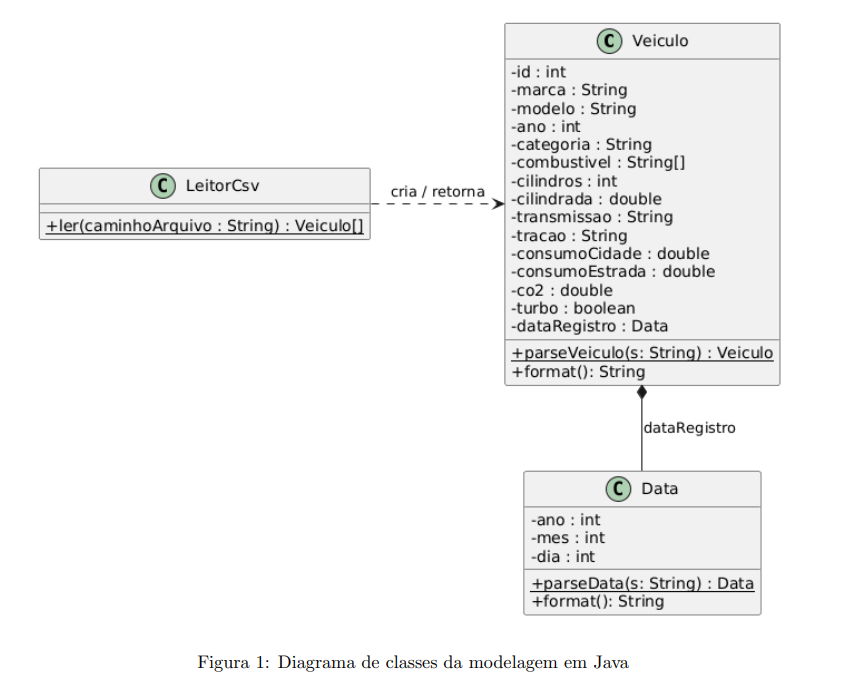
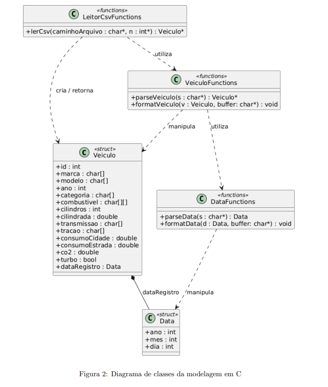

Pontif´ıcia Universidade Cat´olica de Minas Gerais
Instituto de Ciˆencias Exatas e Inform´atica
Algoritmos e Estruturas de Dados II
Trabalho Pr´atico II
Regras B´asicas
1. extends Trabalho Pr´atico 01
2. Neste trabalho, nas quest˜oes em Java, adicionalmente podem ser utilizados os m´etodos
int compareTo(String str), boolean equals(String str), String[] split(String str)
e static String format(String str, Object... args) da classe String, al´em dos
m´etodos que convertem String para tipos primitivos. Nas quest˜oes em C, adicionalmente, podem
ser utilizadas as fun¸c˜oes int strcmp(char* str1, char* str2) e char* strtok(char *str,
const char *delimiters) de string.h, int sscanf(char* str, char* format, ...) e
int sprintf(char* buffer, char* format, ...) de stdio.h, al´em das fun¸c˜oes que convertem string para tipos primitivos.
Dataset - Explorando Ve´ıculos
Este dataset apresenta uma cole¸c˜ao diversificada de ve´ıculos de diferentes fabricantes, categorias e anos, reunindo modelos com variadas caracter´ısticas mecˆanicas e tecnologias
de propuls˜ao. A base contempla ve´ıculos com
diferentes tipos de combust´ıvel, transmiss˜oes,
sistemas de tra¸c˜ao, cilindradas e n´ıveis de
consumo, permitindo uma vis˜ao ampla da
evolu¸c˜ao e da diversidade do setor automotivo.
Atrav´es desses dados, ´e poss´ıvel explorar padr˜oes interessantes, como a rela¸c˜ao entre caracter´ısticas
do motor e consumo de combust´ıvel, diferen¸cas de eficiˆencia entre categorias de ve´ıculos, varia¸c˜oes nas
emiss˜oes de CO2 e a presen¸ca de diferentes tecnologias de transmiss˜ao e propuls˜ao ao longo dos anos.
Cada registro representa uma configura¸c˜ao ´unica de ve´ıculo, contribuindo para um conjunto de dados
rico e multifacetado.
Este dataset convida `a investiga¸c˜ao e an´alise de dados, estimulando o desenvolvimento de solu¸c˜oes
que simulam aplica¸c˜oes do mundo real, como sistemas de busca, recomenda¸c˜ao e organiza¸c˜ao de
informa¸c˜oes. O dataset permite explorar conceitos importantes como organiza¸c˜ao e tipagem de dados,
modelagem de entidades do mundo real, manipula¸c˜ao de estruturas (listas, registros, etc.), bem como
consultas, filtragens e ordena¸c˜oes.
A tabela a seguir apresenta o dicion´ario de dados referente ao dataset. O dataset est´a dispon´ıvel
no arquivo veiculos.csv.
Classe + Registro
O Verde pressup˜oe a presen¸ca do arquivo do dataset (veiculos.csv na pasta /tmp/, de onde seu
programa far´a a leitura. Portanto, o arquivo do dataset deve ser copiado para a pasta /tmp/ em seu
ambiente Linux. Quando reiniciamos o Linux, ele normalmente apaga os arquivos existentes na pasta
/tmp/.
Neste trabalho, voce dever´a realizar a modelagem de dados de um sistema que representa uma
cole¸c˜ao de ve´ıculos. O objetivo e definir estruturas de dados que permitam representar adequadamente
as informa¸c˜oes de cada ve´ıculo, servindo como base para etapas futuras do trabalho, nas quais serao
aplicados algoritmos e estruturas de dados como listas, filas, ´arvores, al´em de operac˜oes de pesquisa e
ordena¸c˜ao.
Observa¸c˜oes
• A modelagem deve ser compat´ıvel tanto com linguagem C quanto Java
• E vedada a dependˆencia de bibliotecas externas ´
• Priorize clareza, organiza¸c˜ao e boa defini¸c˜ao dos tipos
• Pense na reutiliza¸c˜ao das estruturas em etapas futuras
Deve ser observado que a modelagem ser´a utilizada para:
• leitura completa do dataset
• ordena¸c˜ao por diferentes crit´erios (campos simples e compostos)
• busca (sequencial e bin´aria)
• uso de estruturas como listas, pilhas, filas e ´arvores
Tabela 1: Dicion´ario de dados do dataset de ve´ıculos
Campo Descri¸c˜ao Tipo/Formato
id Identificador ´unico do ve´ıculo. Os valores s˜ao inteiros e
n˜ao seguem ordem sequencial no dataset.
Inteiro
marca Fabricante ou marca comercial do ve´ıculo. String
modelo Nome ou identifica¸c˜ao comercial do modelo/configura¸c˜ao
do ve´ıculo.
String
ano Ano-modelo do ve´ıculo. Inteiro – AAAA
categoria Categoria `a qual o ve´ıculo pertence, como carros compactos, utilit´arios esportivos, picapes ou ve´ıculos de dois
lugares.
Categ´orico / String
combustivel Tipo ou tipos de combust´ıvel/energia utilizados pelo
ve´ıculo. Pode possuir mais de um valor, separados por
;, como Gasoline;Electricity ou Gasoline;E85.
Categ´orico multivalorado / String
cilindros N´umero de cilindros do motor a combust˜ao. Para
ve´ıculos puramente el´etricos, utiliza-se o valor 0.
Inteiro
cilindrada Volume total dos cilindros do motor, expresso em litros.
Para ve´ıculos puramente el´etricos, utiliza-se 0.0.
Real, em litros
transmissao Tipo de transmiss˜ao do ve´ıculo. Os valores s˜ao normalizados em Automatic, Manual, CVT e Automated Manual.
Categ´orico / String
tracao Sistema de tra¸c˜ao do ve´ıculo, indicando quais rodas recebem for¸ca motriz, como dianteira, traseira, integral ou
4x4.
Categ´orico / String
consumo cidade Eficiˆencia energ´etica do ve´ıculo em condi¸c˜oes urbanas.
Para ve´ıculos el´etricos, representa o valor equivalente obtido a partir do MPGe.
Real, em km/L ou
km/L equivalente
consumo estrada Eficiˆencia energ´etica do ve´ıculo em condi¸c˜oes rodovi´arias. Para ve´ıculos el´etricos, representa o valor
equivalente obtido a partir do MPGe.
Real, em km/L ou
km/L equivalente
co2 Emiss˜ao direta de di´oxido de carbono do ve´ıculo. Para
ve´ıculos puramente el´etricos, o valor ´e 0.
Real, em g/km
turbo Indica se o ve´ıculo utiliza sistema de sobrealimenta¸c˜ao
por turbocompressor.
Booleano – true ou
false
data registro Data associada `a cria¸c˜ao ou libera¸c˜ao do registro do
ve´ıculo na fonte de dados. N˜ao corresponde necessariamente `a data de fabrica¸c˜ao do ve´ıculo.
Data — AAAAMM-DD
Exerc´ıcios
1. Modelagem em Java: Crie os tipos solicitados seguindo todas as regras apresentadas no
slide unidade00l conceitosBasicos introducaoOO.pdf. Lembre-se:
• os tipos s˜ao criados usando classes
• atributos devem ser privados (encapsulamento!!!)
• implemente os m´etodos get para os atributos
• avalie se deve ou n˜ao implementar os m´etodos set para os atributos
.
A figura 1 apresenta o diagrama de classes para a modelagem em Java. Vocˆe deve seguir este
diagrama como referˆencia para a implementa¸c˜ao do seu c´odigo.
Figura 1: Diagrama de classes da modelagem em Java
O m´etodo format() da classe Data deve retornar uma String que representa a data no formato DD/MM/YYYY. J´a o m´etodo format() da classe Veiculo deve retornar uma String que
representa o ve´ıculo no formato:
[id ## marca ## modelo ## ano ## categoria ## [combustivel] ## cilindros ##
cilindrada ## transmissao ## tracao ## consumoCidade ## consumoEstrada ## co2
## turbo ## dataRegistro]
Nessa quest˜ao, a entrada de dados (entrada padr˜ao) cont´em um conjunto de n´umeros inteiros
organizados um por linha, sendo que cada n´umero representa o id de um ve´ıculo. A ´ultima linha
da entrada de dados cont´em -1, indicando o fim.
Seu programa devr´a imprimir na sa´ıda padr˜ao, em cada linha, o ve´ıculo correspondente ao id
lido na entrada. Portanto, para cada id lido na entrada, dever´a ser feira uma pesquisa sequencial
para encontrar o ve´ıculo correspondente.

2. Modelagem em C: Repita o exerc´ıcio Modelagem em Java, agora na linguagem C. Lembrese que os tipos s˜ao criados usando struct. A figura 2 apresenta o diagrama de classes para a
modelagem em C realizando as devidas adapta¸c˜oes.
Figura 2: Diagrama de classes da modelagem em C
Pesquisa e Ordena¸c˜ao

3. Ordena¸c˜ao por Sele¸c˜ao em C: Usando arranjos, implemente o algoritmo de ordena¸c˜ao
por sele¸c˜ao considerando que a chave de pesquisa ´e o atributo modelo. A entrada e a sa´ıda
padr˜ao s˜ao iguais as da primeira quest˜ao, contudo, a sa´ıda corresponde aos registros ordenados.
4. Ordena¸c˜ao por Inser¸c˜ao em Java: Repita a quest˜ao de Ordena¸c˜ao por Sele¸c˜ao, contudo,
usando o algoritmo de Inser¸c˜ao. A chave de pesquisa ´e o atributo marca.
5. Ordena¸c˜ao por Counting Sort em C: Repita a quest˜ao de Ordena¸c˜ao por Sele¸c˜ao,
contudo, usando o algoritmo Counting Sort, fazendo com que a chave de pesquisa seja o atributo
cilindros.
6. Ordena¸c˜ao por Radixsort em C: Repita a quest˜ao de Ordena¸c˜ao por Sele¸c˜ao, contudo,
usando o algoritmo Radixsort, fazendo com que a chave de pesquisa seja o atributo ano.
7. Ordena¸c˜ao por Bucketsort em Java: Repita a quest˜ao de Ordena¸c˜ao por Sele¸c˜ao,
contudo, usando o algoritmo Bucketsort, fazendo com que a chave de pesquisa seja o atributo
cilindrada normalizada pelo valor 8.1, usando 10 baldes e ordena¸c˜ao por inser¸c˜ao para cada
balde.
8. Pesquisa Bin´aria em C: Implemente o algoritmo de pesquisa bin´aria considerando a
chave prim´aria de pesquisa o atributo modelo. Para a ordena¸c˜ao, use o algoritmo de sele¸c˜ao
implementado anteriormente. A entrada padr˜ao ´e composta por duas partes onde a primeira
´e igual a entrada da primeira quest˜ao. O conjunto de ve´ıculos da primeira parte deve ser
armazenado em um arranjo separado, que servir´a de base para as pesquisas a serem realizadas.
A segunda parte da entrada de dados ´e composta por v´arias linhas. Cada uma possui um
elemento que deve ser pesquisado no arranjo. A ´ultima linha ter´a a palavra FIM. A sa´ıda
padr˜ao ser´a composta por v´arias linhas contendo as palavras SIM/NAO para indicar se existe
cada um dos elementos pesquisados.
Estruturas Lineares
9. Lista com Aloca¸c˜ao Sequencial em Java: Crie uma Lista de registros baseada na de
inteiros vista na sala de aula. Sua lista deve conter todos os atributos e m´etodos existentes na
lista de inteiros, contudo, adaptados para a classe Veiculos. Lembre-se que, na verdade, temos
uma lista de ponteiros (ou referˆencias) e cada um deles aponta para um registo. Neste exerc´ıcio,
faremos inser¸c˜oes, remo¸c˜oes e mostraremos os elementos de nossa lista.
Os m´etodos de inserir e remover devem operar conforme descrito a seguir, respeitando parˆametros
e retornos. Primeiro, o void inserirInicio(Veiculo veiculo) insere um registro na primeira
posi¸c˜ao da Lista e remaneja os demais. Segundo, o void inserir(Veiculo veiculo, int
posicao) insere um registro na posi¸c˜ao posicao da Lista, onde posicao < n e n ´e o n´umero
de registros cadastrados. Em seguida, esse m´etodo remaneja os demais registros. O void
inserirFim(Veiculo veiculo) insere um registro na ´ultima posi¸c˜ao da Lista. O Veiculo
removerInicio() remove e retorna o primeiro registro cadastrado na Lista e remaneja os demais.
O Veiculo remover(int posicao) remove e retorna o registro cadastrado na posi¸c˜ao informada
da Lista e remaneja os demais. O Veiculo removerFim() remove e retorna o ´ultimo registro
cadastrado na lista.
A entrada padr˜ao ´e composta por duas partes. A primeira parte ´e igual a entrada da primeira
quest˜ao e os registros presentes devem ser inseridos ao final da Lista. As demais linhas correspondem a segunda parte. A primeira linha da segunda parte ´e composta de um n´umero inteiro n
indicando a quantidade de registros a serem inseridos/removidos. Nas pr´oximas n linhas, tem-se
n comandos de inser¸c˜ao/remo¸c˜ao a serem processados neste exerc´ıcio. Cada uma dessas linhas
tem uma palavra de comando: II inserir no in´ıcio, I* inserir na posi¸c˜ao informada, IF inserir
no fim, RI remover no in´ıcio, R* remover na posi¸c˜ao informada e RF remover no fim. No caso
dos comandos de inser¸c˜ao, temos tamb´em o identificador do registro a ser inserido. No caso
dos comandos de inser¸c˜ao na posi¸c˜ao informada, a posi¸c˜ao fica imediatamente ap´os a palavra de
comando. A sa´ıda padr˜ao tem uma linha para cada registro removido, sendo que essa informa¸c˜ao
ser´a constitu´ıda pela palavra “(R)” e os atributos marca modelo do registro removido. No
final, a sa´ıda mostra os registros presentes na Lista do primeitro ao ´ultimo.
10. Fila Circular com Aloca¸c˜ao Sequencial em C: Crie uma Fila Circular de registros.
A fila deve ter tamanho cinco (capacidade m´axima). A entrada padr˜ao ser´a como a da quest˜ao
Lista com Aloca¸c˜ao Sequencial, contudo, teremos apenas os comandos I para inserir (enfileirar)
e R para remover (desenfileirar). Quando o programa tiver que inserir um registro e a fila estiver
cheia, antes, ele deve fazer uma remo¸c˜ao.
Para cada registro removido da fila, a sa´ıda padr˜ao apresenta a palavra “(R)” e os atributos
marca modelo do registro removido. No final, a sa´ıda mostra os registros presentes na fila do
primeitro ao ´ultimo.
11. Lista com Aloca¸c˜ao Flex´ıvel em C: Refa¸ca a Quest˜ao “Lista com Aloca¸c˜ao Sequencial”
usando lista simplesmente encadeada.
12. Pilha com Aloca¸c˜ao Flex´ıvel em Java: Crie uma Pilha simplesmente encadeada de
registros. Neste exerc´ıcio, faremos inser¸c˜oes, remo¸c˜oes e mostraremos os elementos de nossa pilha
a partir do topo. A entrada e a sa´ıda padr˜ao ser˜ao como as da quest˜ao “Lista com Aloca¸c˜ao
Sequencial”, contudo, teremos apenas os comandos I para inserir (empilhar) e R para remover
(desempilhar).
13. Lista Dupla com Aloca¸c˜ao Flex´ıvel em Java: Refa¸ca a Quest˜ao “Lista com Aloca¸c˜ao
Sequencial” usando lista duplamente encadeada.